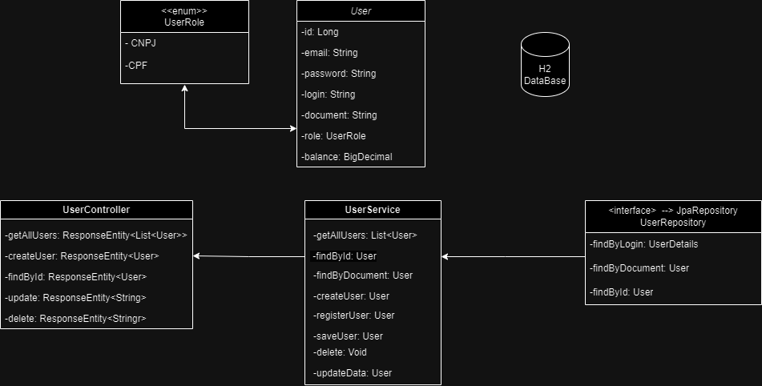
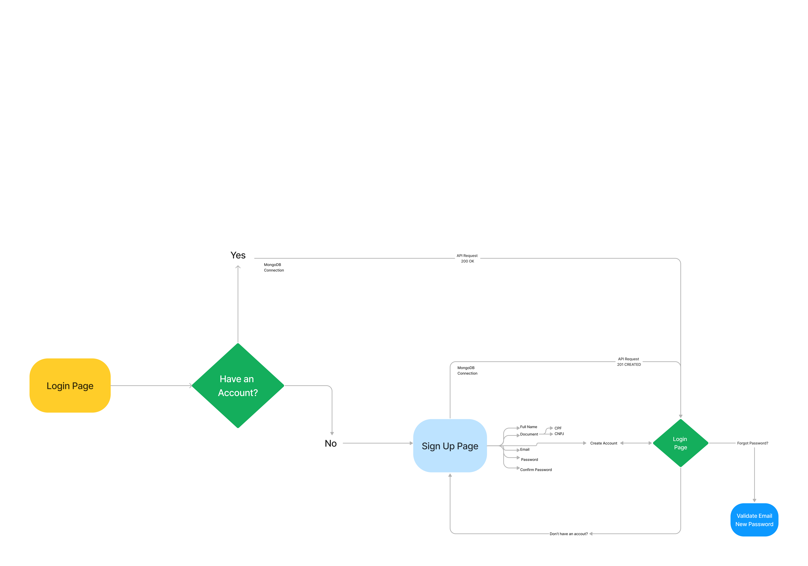

# Authentication with Banking API Systems


This project is an API built using **Java, Java Spring,H2 as database and Spring Security and JWT for authentication control** where the focus main is the Security.

The main objective of the project is to create an authentication with bank system where the login, registration, password recovery, account management, add cards for transfers and deposit is the main funcionality. 
## 🛠 Skills
- ☕ Language: Java | HTML | CSS | JavaScript

- 📚 Libraries: ReactJS | Axios

- 🛠 Framework: Spring Boot 3 | Spring Data | Spring Security 6

- 🛢️ Banco de Dados: MongoDB, H2 DataBase, SQL
  
- 🔧 Tools: Postman, Apache Maven, Swagger, JWT Token, JPA, Hibernate, REST API


## Roadmap

- Desenvolvimento de APIs robustas e eficientes

- Adicionar integrações com APIs

- Injeção de Dependências e Inversão de controle

- Arquitetura Hexagonal e DDD(Domain-Driver Design) 


- Desenvolvimento da class User e suas ferramentas na produção




- UML Login and Register Page




## Documentação da API

#### Retorna todos os usuários

```http
  GET /users
```

| Parâmetro   | Tipo       | Descrição                           |
| :---------- | :--------- | :---------------------------------- |
| `users` | `string` | **Retorna todos os usuários** |

#### Retorna um usuário

```http
  GET /users/id
```

| Parâmetro   | Tipo       | Descrição                                   |
| :---------- | :--------- | :------------------------------------------ |
| `id`      | `Long` | **Retorna usuário por ID** |

#### Deleta um usuário

```http
  DELETE /users/id
```

| Parâmetro   | Tipo       | Descrição                                   |
| :---------- | :--------- | :------------------------------------------ |
| `id`      | `Long` | **Deleta usuário por ID** |

#### Cria um usuário

```http
  POST /users/auth/register
```

| Parâmetro   | Tipo       | Descrição                                   |
| :---------- | :--------- | :------------------------------------------ |
| `login`      | `String` | **Cria um login** |
| `password`   | `String` | **Cria uma senha** |
| `email`      | `String` | **Cria um email** |
| `roles`      | `Role`   | **Cria um CPF ou CNPJ** |


## Documentação

All references about this project they were removed [Spring Framework](https://glysns.gitbook.io/spring-framework/) and [Swagger](https://www.bezkoder.com/spring-boot-swagger-3/)

# Colaborators

This project was developed by 
<a href="https://www.linkedin.com/in/erick-miyagi-310016258/" target="blank"/>ErickMiyagi</a> and
<a href="https://www.linkedin.com/in/leonardo-lermen-768769242/" target="blank"/>leonardolermen</a>


