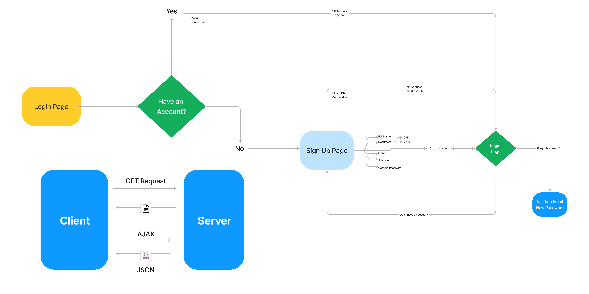

# Authentication with Banking API Systems

This project is an API built using **Java,Spring Boot, MongoDB as database and Spring Security and JWT for authentication control** where the focus main is the Security.

The main objective of the project is to create an authentication with bank system where the login, registration, password recovery, account management, add cards for transfers and deposit is the main funcionality. 
## 🛠 Skills

- 🌐 Language: Java  

- 📱 App Development: React Native + Expo

- 🛠 Framework: Spring Boot 3 | Spring Data | Spring Security 6

- 🛢️ DataBases: MongoDB e Redis
  
- 🔧 Tools: Postman, Apache Maven, Swagger, JWT Token, JPA, Hibernate, REST API e Docker

## Roadmap

- Login and Register Page with React, where he is the SPA(Single Page Application)  

- This UML exemplifies the classes and their functions in each

## Documents

All references about this project they were removed [Spring Framework](https://glysns.gitbook.io/spring-framework/) and [Swagger](https://www.bezkoder.com/spring-boot-swagger-3/)

# Colaborators

This project was developed by 
<a href="https://www.linkedin.com/in/erick-miyagi-310016258/" target="blank"/>ErickMiyagi</a> ,
<a href="https://www.linkedin.com/in/leonardo-lermen-768769242/" target="blank"/>leonardolermen</a> and
<a href="https://www.linkedin.com/in/pedro-cola%C3%A7o-929097302/">pedrocolaço</a>

